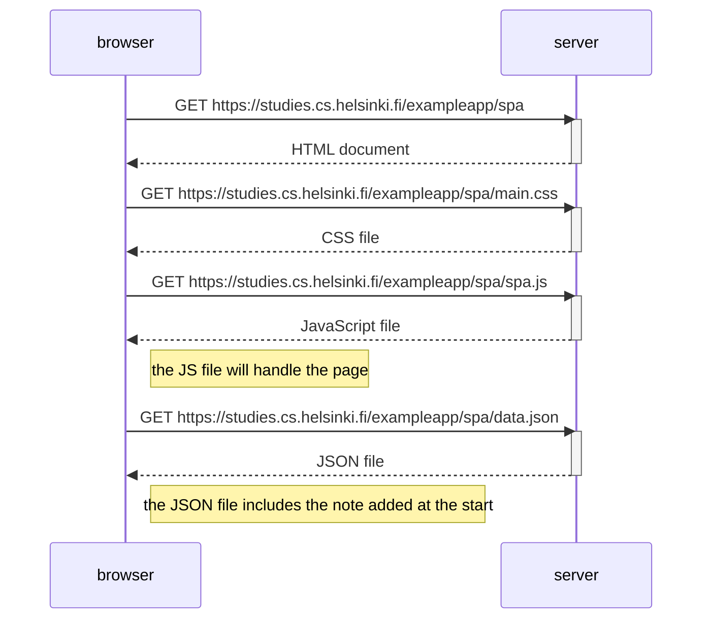

# Single Page App Diagram

Sequence diagram for requesting a SPA.

```mermaid
sequenceDiagram
    participant browser
    participant server

    browser->>server: GET https://studies.cs.helsinki.fi/exampleapp/spa
    activate server
    server-->>browser: HTML document
    deactivate server

    browser->>server: GET https://studies.cs.helsinki.fi/exampleapp/spa/main.css
    activate server
    server-->>browser: CSS file
    deactivate server

    browser->>server: GET https://studies.cs.helsinki.fi/exampleapp/spa/spa.js
    activate server
    server-->>browser: JavaScript file
    deactivate server

    Note right of browser: the JS file will handle the page

    browser->>server: GET https://studies.cs.helsinki.fi/exampleapp/spa/data.json
    activate server
    server-->>browser: JSON file
    deactivate server

    Note right of browser: the JSON file includes the note added at the start
```
